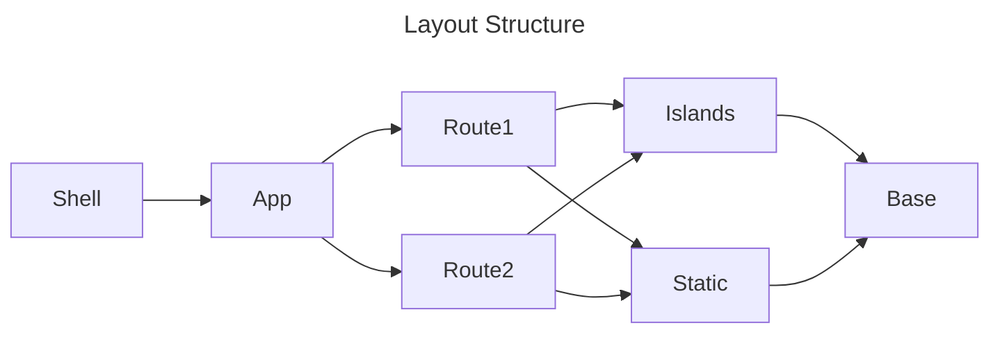

# Realmspace
Project to learn Rust, UX Design, Reactive Webdev, Data Structure/API Design, FullStack Application building etc

Disclaimers:
* I started with Rust the same day I started this project, this means I probably have been naive and incorrect with my implementation.
* I have some limited frontend experience but not a lot, so I am learning reactive design, implementation, tailwind etc at the same time.
* While I am experienced with devops/platform eng, I never normally need to structure projects myself so forgive me if I have made mistakes.

This is all to say I am probably making a big mess and what works for me may not work for you, but it's part of the journey.

## Get Started:
To get started you need the rust toolchain and some extras.

>If you are on a Mac you will probably need Xcode installed
>
>```bash
> xcode-select --install
>```
>
Install Rust:
```bash
curl --proto '=https' --tlsv1.2 -sSf https://sh.rustup.rs | sh
```
This project is built against `Stable`, not `Nightly` so you can just accept the default options.

Set up the Correct Compilation Target:
```bash
rustup target add wasm32-unknown-unknown
```
Install Extras:
```bash
cargo install cargo-leptos
```

Run the Project
```bash
cargo leptos watch
```
And then just open your browser at http://localhost:8000

Because I am building against `stable` Rust I do not have auto-reload enabled but the watch command will rebuild on the fly you just need to refresh the page.

`Nightly` builds of Leptos support hot-reloading, but I am sticking to stable for the time being.

Occasionally it is a good idea to run `cargo clean` to clean up leftover artifacts as the accrue pretty quickly.

## What is this project?

This project is for me to learn several disciplines I am interested in. 

It's been a while since I have done any development on my own, and truth be told, I have only ever been a minor contributor to projects in the past. 

I wanted to get back into it at the deep-end building an overengineered, technology-shoehorned-in, Rust-based Fullstack app for my own sake.

### Goal

Create a delightful, performant, OpenAI API compatible chat client, that can ideally run on the smallest ref hardware possible with a consistent experience across all of my devices.

I will probably do a full writeup when I am further along about what I have decided and why.

### Project Structure

Majority of work should be done in the `app` folder:

Top-Level

* `app/src/lib.rs` - Main Application code
* `app/src/styles` - Top-Level Stylesheet and Theme Presets

Routes

* `app/src/routes` - Routes

Components

* `app/src/components/base` - Base Components
  * `mod.rs` - Exports the base components for use in other files - if you add new components to this folder you need to update this
  * `<component>.rs` - Each component has a corresponding rust file
  * `styles` folder for component specific behaviours
* `app/src/components/islands` - Interactive Components (See the [Islands Feature](https://book.leptos.dev/islands.html) of Leptos)
  * `mod.rs` - Exports the components for use in other files - if you add new components to this folder you need to update this
  * `<component>.rs` - Each component has a corresponding rust file
  * `styles` folder for component specific behaviours
* `app/src/components/static` - Static Components (See the [Islands Feature](https://book.leptos.dev/islands.html) of Leptos)
  * `mod.rs` - Exports the components for use in other files - if you add new components to this folder you need to update this
  * `<component>.rs` - Each component has a corresponding rust file
  * `styles` folder for component specific behaviours

Additional
* `frontend` - Responsible for generating WASM
* `backend` - Responsible for the actual server aspect
* `public` - This is just the assets folder - it has some fonts in it
* ~~`src-tauri` - configuration and build scripts for tauri to build different applications properly~~

### Layout Structure

For the Web-Dev side the structure should be familiar to most React devs but if it helps, here it is laid out logically:



* App
  * Files: `app/src/lib.rs`
  * Shell is a wrapper function for the `<head>` tags with some of the Tailwind/Meta configurations built in and calls App as a separate component
  * App is the main piece to worry about as it contains `<body>` tags and also the routing information (i.e. which pages are available)
* Routes
  * Files: `app/src/routes/*`
  * The various routes/pages defined in the application (i.e. Homepage, About etc) - these are usually composed of a mix of Island, Static and Base components
* Components
  * Islands
    * Files: `app/src/components/islands/*`
    * Islands are an experimental feature of Leptos where a distinction is made for components of a page that require reactivity/dynamic changes (i.e. progress bar)
    * Islands are the interactive ones and I thought it best to separate them from static ones
  * Static
    * Files: `app/src/components/static/*`
    * Static Components don't require reactivity and are rendered as pure html/css at compile time - this can supremely improve performance and allows for fine-tuning your applications load/size at the cost of some more advanced capabilities in static areas
  * Base
    * Files: `app/src/components/base/*` 
    * All components I build for the application are made from fundamental building block you find here

> Styling is collocated at each individual level with an appropriate `styles` directory.

### Important Packages

* Leptos - a Rust-based Web-Framework that compiles into WASM
  * Specifically this is the SSR Flavour - this is the bulk of the logic
  * I chose this as I wanted something as performant and small as possible and Leptos seemed to be a favourite for most people and I love the idea of WebAssembly.
* Tailwind CSS - popular CSS post-processor
  * I have never been into Tailwind but it keeps coming up so wanted some more experience with it
* Retro UI - Cute Pixel Art Library
  * I have ported a couple of components from this library to see how I get on with it - this BSD licensed so where I have derived the components I have included the license as appropriate.
* ~~Tauri - A Rust-Based Application Builder~~ - Disregard this for now
  * ~~This builds my application into a native app (native being relative ofc)~~

I started with the very [convenient template](https://github.com/Alt-iOS/tailwind-leptos-tauri-template) found here:
```bash
https://github.com/Alt-iOS/tailwind-leptos-tauri-template
```
You'll notice some of the project structure is similar but I have diverged from the template:

* The template relies on syntax from pre-0.7 Leptos and 0.7 Leptos introduced some very significant changes 
  * I have updated this project to the latest packages and syntax and introduced full islands support to being optimising package sizes
* I have introduced a `components` folder with and will be extending this as I bring in more components myself, and I have created a test component.
  * I have ported a couple of components from JSX to Rust from [RetroUI](https://www.retroui.io/components) - mainly because I thought they were cute and I thought it would be a good first test of what I learned
* I have changed the dependency structure to be a bit cleaner using `cargo autoinherit` because I got annoyed updating leptos in 5 cargo files ([autoinherit details here](https://github.com/mainmatter/cargo-autoinherit))
* I have cleaned up a lot of items including moving around stylesheets and adding the idea of split out css modules per component (not totally happy with the current layout but I will get there)
* I added some extra improvements and QoL fixes around RustRover/Rust-Toolchain as well
* I originally took out  the tracing and otel integrations - I have since restored tracing as I plan to add heap analysis and profiling to track progress against certain constraints.

### Future Integrations:
* ~~[Redb](https://github.com/cberner/redb)~~ [Bevy ECS]() + [Bevy PKV](https://github.com/johanhelsing/bevy_pkv)
  * ~~Another highly performant Rust Service - A K/V Store that I am excited to begin learning data structuring for~~
  * Most likely I am going for Bevy ECS with Bevy PKV which uses RedDB underneath and gives me ECS as a data framework with an interesting idea around 'systems' for server functionality
* [Protobufs](https://github.com/tokio-rs/prost)
  * Not sure how feasible protobufs are for Leptos with server functions being inline, or with ECS handling data but I want to learn them and use them properly for personal reasons
* Trying to run on a Pi or PiZero (or pref Pico) 
  * One of the reasons I have chosen WebAssembly is for the optimal binary sizes and security to try and fit some or all of the project on a tiny device - this is a stretch goal and I need more progress to get there as in the Pico's case it's an Arm Cortex-M chip nd this will require a huge amount more effort to build.
* ~~[Leptos Islands](https://book.leptos.dev/islands.html)~~ - Done
  * ~~This feels like the correct way to optimise performance utilizing pure html+css where possible and then 'islands' of WASM for interactive tasks~~
* ~~[Tracing](https://github.com/tokio-rs/tracing)~~ Done + [Tokio Console](https://github.com/tokio-rs/console) for better performance measuring and automating benchmarks
  * Understandably the original template was trying to use OpenTelemetry with Tracing - but I found it a bit icky with docker-compose and jaeger - I may yet revisit otel but I am more interested in solutions like Tokio-Console and Parca from Polar Signals for future deployments.
* Gherkin and Cucumber or some test framework
  * I like the idea of using Rust comments and also Gherkin test syntax to auto-build docs and I do want to learn testing strategies with this project as well.

